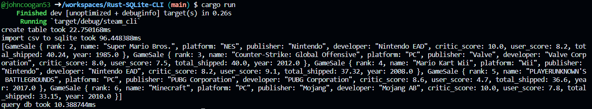
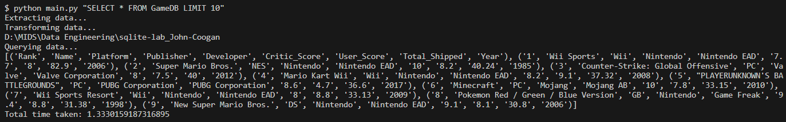

# rust-python SQLite comparison

This rust project implements SQLite queries through the rusqlite crate. This implementation is done in parallel with a previous python sqlite project so that the performance increase can be measured. The python project can be referenced at this repository link: https://github.com/johncoogan53/sqlite-lab_John-Coogan and metrics for its ouput will be shown below.

## Project description
This rust project uses video game sales data taken from kaggle in a similar fashion as the python project. It contains a lib.rs file which creates a rusqlite table, imports the csv data to the database, and queries that database. The main.rs file simply calls each of those lib functions while running a profiler for performance metrics. 

## Performance Results:
We see below the rust projects performance with table creation taking 322 microseconds, csv import taking 74ms, and the query taking 298 micro seconds. All together, the project runs in about 74.5 milliseconds or 0.0745 seconds. This is a single run and these times vary moderately but the comparison is quite clear when we look at the python run times.

Below we look at the python terminal output:
 

 We can see here that the python script takes 1.33 seconds to complete the same query. The performance increase is quite clear here. 

 ## Python vs. Rust

 This performance increase was not initially so dramatic. Initial csv load times for rust were extremely long (on the order of minutes), this is because of the fact that rust gives immense and detailed control to the programer. This is a double edged sword however, initial csv load implementations loaded each line of the csv at a time. After investigating why this takes so long, it is because batch queries must be implemented manually either through batch_execute or a transaction. Batch_execute allows for a manually specified batch size to be used so that database interactions area minimized. It is a way to manually tune the performance of this project. The current batch size, specified in bits, is 9999999999999999999. Through loggin implementation, it can be increased until all queries are executed in one batch which, for a dataset this small, will likely further increase the performance. 

 This performance increase is great, but it does come at a cost. Learning rust. Rust is an interesting language that is very unforgiving. Because it is defensive in nature, allowing for very little implicit coding references, the language can be very difficult to work with. It is also very difficult to read, where python is a human readable language, rust is a language of its own. That said, even after this small project and the use of extensive debug logging, I feel like I have quickly started to catch on to some of rust's nuances. 

 A massive frustration with rust so far is how much more needs to be done that python does implicitly. A comparison between these two projects shows this. In python a payload is generated via a csv reader and execute many handles the multiple row insertion into an open connection. In rust, a dedicated struct is created and a batch execute is conducted in a for loop. Mild data cleaning was required in real time as rusqlite panicked from non-standard titles in developer or publisher, highly strict variable assignment was necessary, and the borrowing/ownership/variable lifetime system is highly counterintuitive.