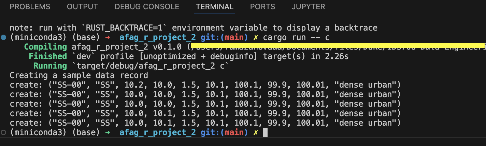
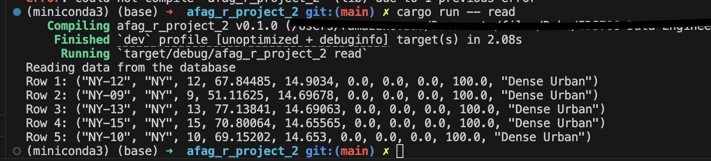
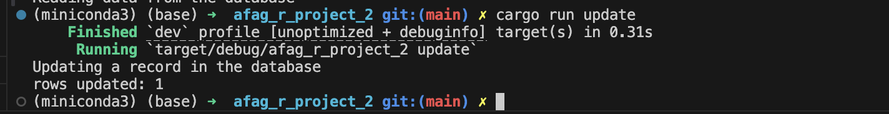
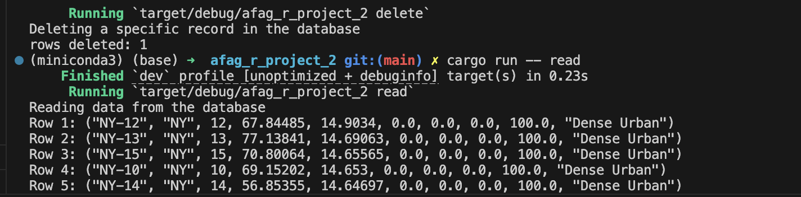

# Rewriting a CRUD Operations Python Script in Rust

[](https://github.com/nogibjj/AfagR_individual_project2/actions/workflows/CI.yml)

A command-line interface (CLI) tool built with Rust for interacting with an SQLite database. This tool allows users to perform various operations such as data extraction, loading CSV files into SQLite, creating and deleting records, and running queries. It’s designed to work efficiently with large datasets and demonstrates the use of asynchronous requests, error handling, and basic CRUD operations.

## Table of Contents
- [Overview](#overview)
- [Features](#features)
- [Prerequisites](#prerequisites)
- [Installation](#installation)
- [Usage](#usage)
- [Commands](#commands)
- [Example Usage](#example-usage)
- [Testing and Linting](#testing-and-linting)
- [Project Structure](#project-structure)
- [Usage of Large Language Models](#usage-of-large-language-models)
- [Binary Artifact Download Link](#binary-artifact-download-link)
- [Video explanation](#video-explanation)

---

## Overview
The Rust-SQLite-CLI project provides a command-line interface to interact with an SQLite database, offering a range of data operations for simplified data management and analysis.

## Features
- **Extract Data**: Download a file from a URL and save it locally.
- **Load Data**: Load data from a CSV file directly into an SQLite database.
- **Create Record**: Insert a new record into the database.
- **Read Data**: Query data and retrieve the first few records.
- **Update Record**: Modify existing records in the database.
- **Delete Record**: Remove specific records from the database.

## Prerequisites
- **Rust**: Ensure Rust is installed. Follow the [Rust installation guide](https://www.rust-lang.org/tools/install).
- **SQLite**: An SQLite database is required for data storage and querying.
- **Cargo**: Cargo, Rust's package manager, should be installed.

## Installation
Clone this repository and navigate to the project directory:

```bash
git clone https://github.com/Afag-Ramazanova/Rust-SQLite-CLI.git
cd Rust-SQLite-CLI 
```
Install dependencies and build the project:

```bash 
cargo build
``` 

## Usage
Run the CLI tool using cargo or build a release version:

``` bash 
cargo run -- [COMMAND] [OPTIONS]
# or
cargo build --release
./target/release/Rust-SQLite-CLI [COMMAND] [OPTIONS]
```

## Commands

The following commands are available:

- extract
Download a file from a specified URL.

``` bash
cargo run -- extract "https://raw.githubusercontent.com/fivethirtyeight/data/refs/heads/master/district-urbanization-index-2022/urbanization-index-2022.csv"  "data/urbanization.csv"
```

- load

Load data from a CSV file into the SQLite database.
``` bash 
cargo run -- load "data/urbanization.csv"
```


- create

Insert a sample record into the database.
``` bash 
cargo run -- create
``` 
Below you can see the result of the command: 



- read
Query the database and display the first 5 rows.
``` bash 
cargo run -- read
```
Below you can see the result of the command: 



- update

Update a specific record in the database.

``` bash
cargo run -- update
```

Below you can see the result of the command: 



- delete

Delete a specific record from the database.
``` bash 
cargo run -- delete 
``` 
Below you can see the result of the command: We deleted the stcd with NY-09, 2nd row in the table. Here we can't see it because we deleted that record. 


## Testing and Linting
To run tests and check for linting errors, use the following commands:

- Run Tests:
``` bash 
make test
```

- Lint the Code:
``` bash 
make lint
``` 

## Project Structure

A brief overview of the project’s structure:

- src/lib.rs: Contains the core functions for database operations.
- src/main.rs: The CLI entry point that parses commands and calls functions in lib.rs.
- Cargo.toml: The configuration file for managing dependencies and project metadata.
- Makefile: Contains commands for building, testing, and linting the project.

## Usage of Large Language Models

In the development of this project, Large Language Models (LLMs) such as ChatGPT by OpenAI and GPT-4 were utilized to assist with code writing, debugging, and documentation. These LLMs helped streamline complex Rust concepts, suggesting optimizations for data handling and SQLite integration, as well as providing recommendations on Rust’s error handling and best practices for a CLI interface.

The use of LLMs enhanced the development process by:

- Suggesting code improvements for data extraction, loading, and query handling in SQLite.
- Generating concise documentation and usage examples to improve user experience.
- Debugging complex code sections related to async operations, error handling, and database interactions.

## Binary Artifact Download Link

[Binary Artifact Link](https://github.com/nogibjj/AfagR_individual_project2/actions/runs/11566491095/artifacts/2115575219)

#### Video Explanation

[Demo Video](https://youtu.be/EF3zQbRUkVs)